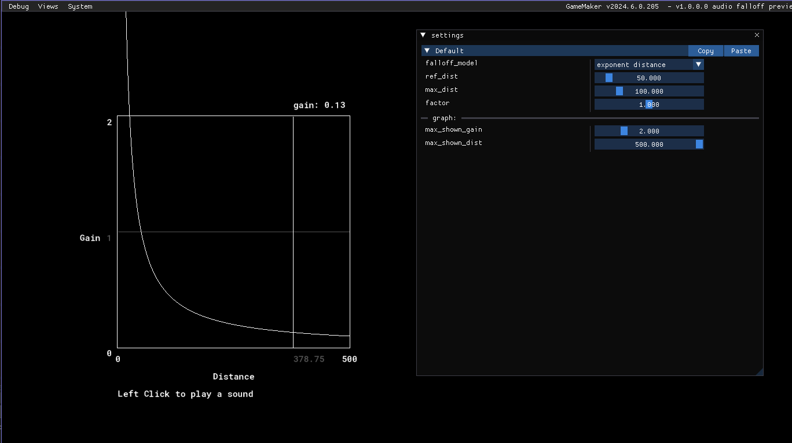

# gm-audio-falloff-previewer
 
What the heck do the audio falloff models do in GameMaker?? I threw together this tool so you can see what they do.
gm version IDE v2024.6.2.162  Runtime v2024.6.1.208

[GameMaker docs for `audio_falloff_set_model()`](https://manual.gamemaker.io/monthly/en/#t=GameMaker_Language%2FGML_Reference%2FAsset_Management%2FAudio%2Faudio_falloff_set_model.htm)
